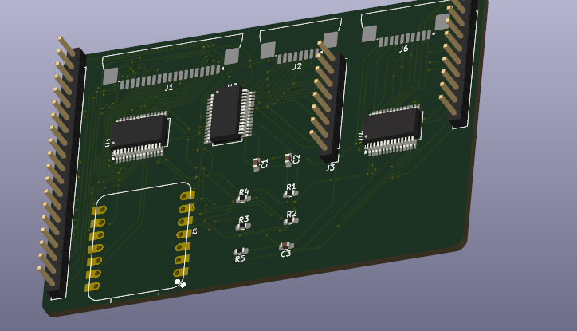

# Olivetti Philos 44 Retro Build

A retro-computing project built around an **Olivetti Philos 44**, combining its original vintage hardware and design with modern electronics.

## Project

The goal of this project is to restore and modernize the Olivetti Philos 44 while keeping its original retro appearance.

One of the main parts of the project is a **custom USB keyboard PCB**, designed to replace the original keyboard interface and allow the Olivetti keyboard to be used as a standard USB keyboard with a modern computer.

## Features

* Original Olivetti Philos 44 keyboard
* Custom PCB for USB conversion
* Modern USB connectivity
* Retro Olivetti design preserved
* Custom electronics designed for the project

## Hardware

The project uses:

* Olivetti Philos 44
* Original Olivetti keyboard
* Custom USB keyboard PCB
* Microcontroller
* USB connection
* Custom wiring and connectors

## Goal

The objective is not to completely replace the original machine, but to give the Olivetti Philos 44 a new life while preserving as much of its original hardware and appearance as possible.

## Status

**In development**

The hardware and PCB are currently being designed and tested.

## Why?

Vintage computers have a unique design and feel that modern hardware does not reproduce. This project aims to combine that retro experience with the convenience and compatibility of modern USB hardware.

---

Made with a mix of **vintage Olivetti hardware and modern electronics**.

## Build Images

### Custom USB Keyboard PCB

## Bill of Materials Of the Keyboard Pcb

| Component                | Quantity | Purpose                 |
| ------------------------ | -------: | ----------------------- |
| Seeed Studio XIAO RP2040 |        1 | Main microcontroller    |
| MCP23017-E/SS            |        1 | GPIO expansion          |
| 0603 Resistors           |    1 set | PCB components          |
| 0603 Capacitors          |    1 set | PCB components          |
| 2.54mm Pin Headers       |    1 set | Connections             |
| Custom PCB               |        1 | USB keyboard controller |

See `BOM.csv` for the complete bill of materials, including component prices and purchase links.

## Hardware Design Files

The source files used to design the custom hardware are included in this repository.

### PCB

The PCB source files are located in the `PCB/` directory.

They include the original editable design files used to create the custom USB keyboard PCB.

### Schematic

The schematic used to design and connect the keyboard controller is included with the PCB design files.

### Manufacturing Files

Gerber files and other manufacturing files are included when available, allowing the PCB to be reproduced.

## Documentation

The development process and reverse-engineering work are documented through the project's devlog entries.

The documentation includes:

* Reverse engineering of the original Olivetti keyboard
* Mapping of the keyboard matrix
* Documentation of the keyboard connectors
* PCB design and revisions
* Testing of the custom electronics
* Integration of modern electronics with the original hardware
